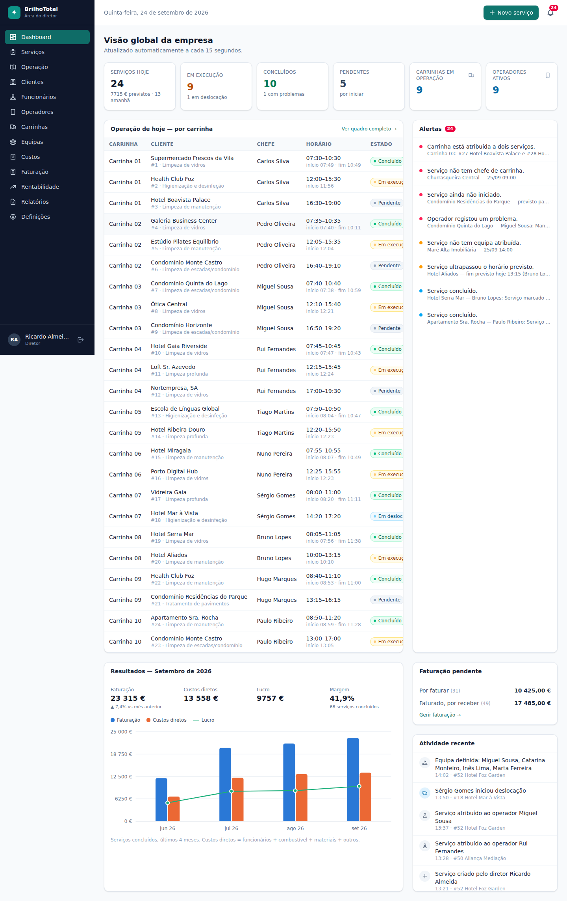
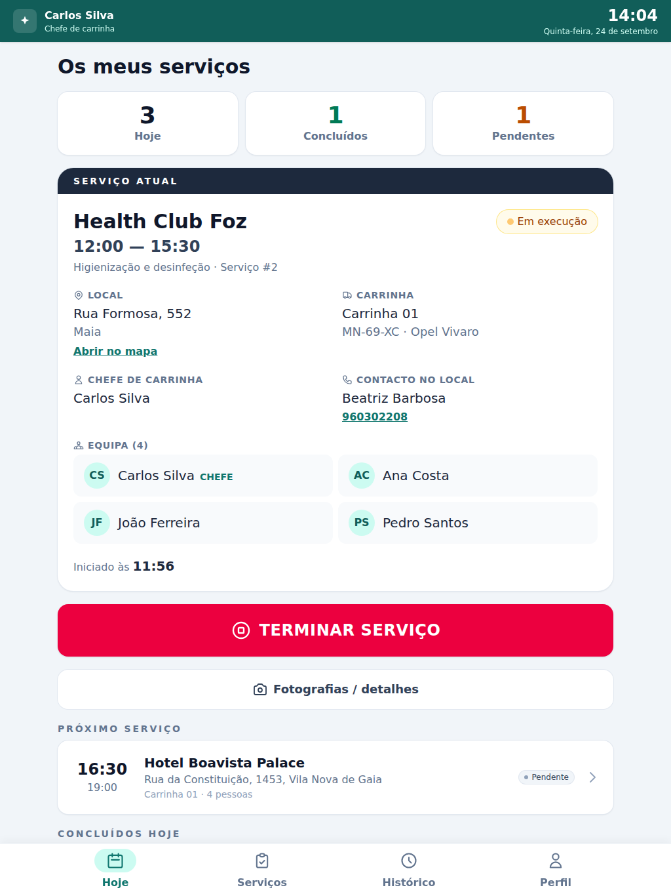
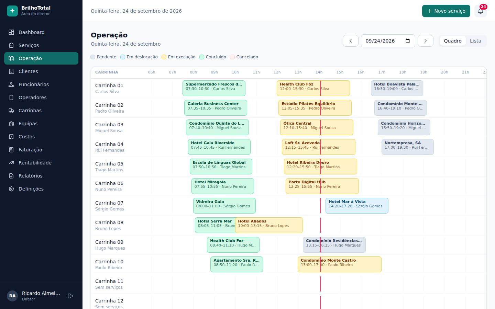
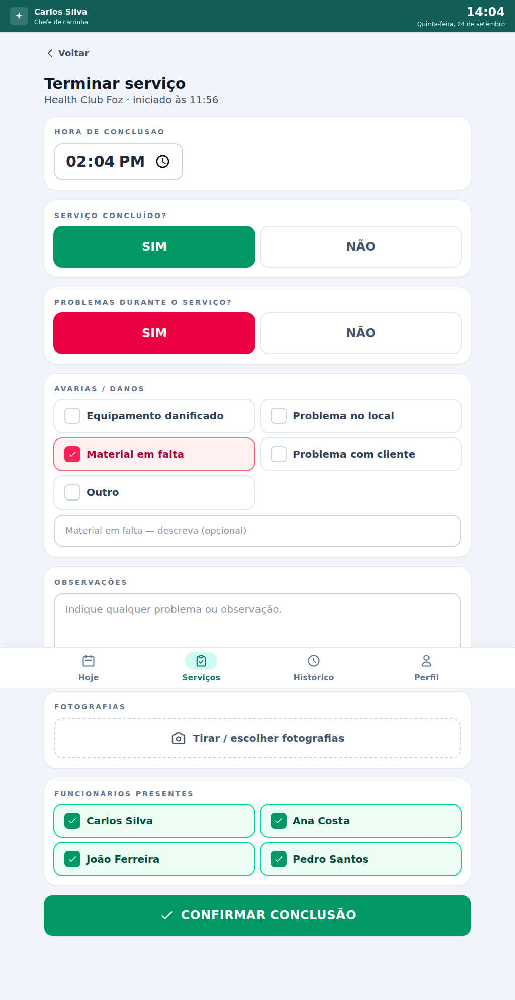
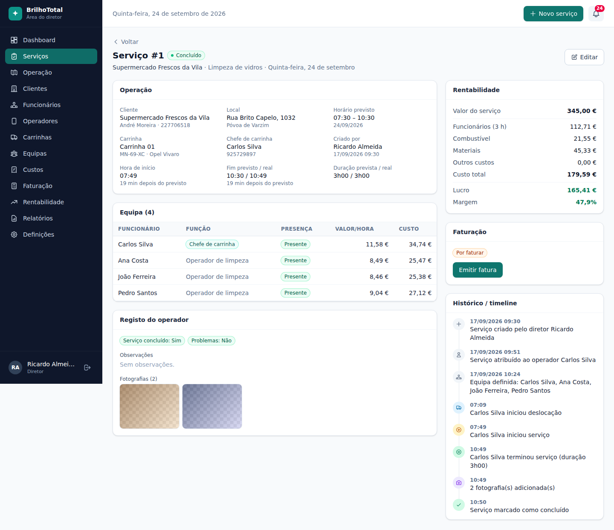
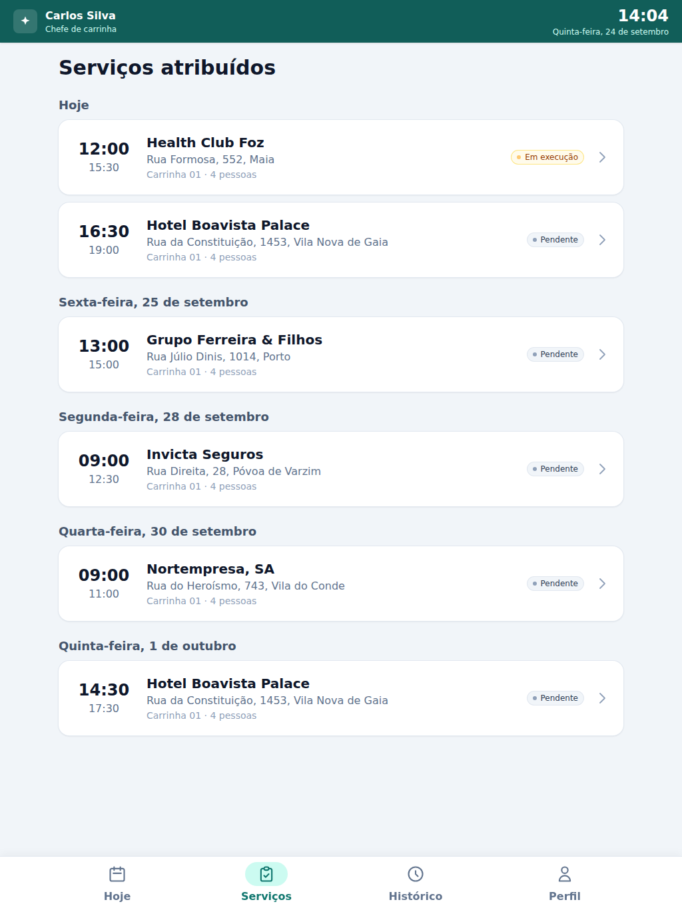

# BrilhoTotal — Gestão operacional e financeira (empresa de limpeza)

Plataforma web que funciona como o "sistema operacional" da empresa:

```
DIRETOR → planeia → atribui CARRINHA + CHEFE + EQUIPA → OPERADOR executa no tablet
→ regista conclusão → DIRETOR recebe os dados → sistema calcula custos, lucro e margem
```

## Níveis de acesso

| Função | Acesso | Como é garantido |
|---|---|---|
| **Diretor** | Tudo: dashboard global, serviços, operação, clientes, funcionários, operadores, carrinhas, equipas, custos, faturação, rentabilidade, relatórios, definições | `/api/admin/*` exige a função `director` |
| **Operador / chefe de carrinha** | Só os serviços **que lhe foram atribuídos**: iniciar deslocação, iniciar, terminar, observações, fotografias, avarias, presenças. Nunca vê valores, custos, margens, salários nem outros serviços | `/api/op/*` exige a função `operator` e todas as consultas filtram por `operator_id = utilizador`. As respostas usam uma lista branca de campos, sem nada financeiro. Serviços ou fotos de outros devolvem 404 |
| **Funcionário** | Sem acesso | Existe apenas como registo (`employees`), sem login |

A segurança está na **API**, não só na interface: um operador que altere o URL para `/diretor/...` é
reencaminhado e, mesmo chamando a API diretamente, recebe `403`. A sessão usa um cookie `httpOnly` +
`SameSite=Strict` com JWT. O utilizador é recarregado da base de dados em cada pedido, por isso
desativar uma conta corta o acesso de imediato. Há também um cabeçalho anti-CSRF obrigatório nos pedidos
de escrita, limite de tentativas de login e validação do conteúdo real das fotografias.

## Capturas de ecrã

| Diretor | Tablet do operador |
|---|---|
|  |  |
|  |  |
|  |  |

Todas as capturas estão em [`docs/screenshots/`](docs/screenshots/).

## Stack

- **server/** — Node.js 22 (≥ 22.13) + Express 5 + SQLite (`node:sqlite`, sem dependências nativas).
- **client/** — React 19 + TypeScript + Vite + Tailwind 4. A área do diretor é para desktop e a do
  operador para tablet, com botões e texto grandes.

## Arranque rápido

```bash
cd limpeza
npm run install:all
npm run build        # compila o frontend (servido pelo servidor)
npm start            # http://localhost:3000
```

No primeiro arranque, a base de dados (`server/data/limpeza.db`) é criada com dados de demonstração.
Para os recriar (as datas são relativas ao momento atual, por isso o dashboard de "hoje" tem sempre
serviços em curso):

```bash
npm run seed
```

Desenvolvimento com hot-reload: `npm run dev:server` e `npm run dev:client` (http://localhost:5173,
com proxy de `/api` para a porta 3000).

### Contas de demonstração

| Função | Utilizador | Password |
|---|---|---|
| Diretor | `diretor` | `diretor123` |
| Operador (pode ajustar a equipa) | `carlos.silva` | `operador123` |
| Operador | `rui.fernandes`, `pedro.oliveira`, … (10 no total) | `operador123` |

### Dados de demonstração

1 diretor, 10 operadores (cada um é também um registo de funcionário, com o cargo "Chefe de carrinha"),
40 funcionários sem acesso, 15 carrinhas, 10 equipas base, 100 clientes e 300 serviços (≈100 dias de
histórico, hoje e os próximos 10 dias). Inclui custos gerais, faturas, pagamentos a funcionários,
fotografias e problemas. Também inclui situações que disparam **todos** os alertas: serviço não
iniciado, horário ultrapassado, carrinha em dois serviços, serviço sem chefe e serviço sem equipa.

## Cálculos

- **Duração**: real (início → fim registados pelo operador) quando existe. Caso contrário, a prevista.
- **Custo de funcionários**: duração × soma do valor/hora dos funcionários **presentes**. O valor/hora
  fica guardado no momento da atribuição, para que alterações futuras não mudem o histórico.
- **Custo total** = funcionários + combustível + materiais + outros. **Lucro** = valor − custo total.
  **Margem** = lucro ÷ valor.
- A rentabilidade global inclui ainda os custos gerais (seguros, manutenção, renda, …) para o resultado líquido.

## Configuração

| Variável | Por omissão | |
|---|---|---|
| `PORT` | `3000` | |
| `DATA_DIR` | `server/data` | base de dados + fotografias |
| `SESSION_SECRET` | gerado e guardado em `DATA_DIR/.session-secret` | |
| `SECURE_COOKIES` | desligado | `1` em produção com HTTPS |
| `APP_TZ` | `Europe/Lisbon` | fuso para "hoje", meses, etc. |

## Testes

```bash
npm test
```

Testam, entre outros: o operador recebe 403 em todas as rotas administrativas; só vê os seus serviços e
fotos; nenhuma resposta do operador tem campos financeiros; a desativação da conta é imediata; o
fluxo completo diretor → operador → diretor (timeline, presenças, fotos, problemas, alertas); o cálculo
de custo, lucro e margem; e a deteção dos alertas.
